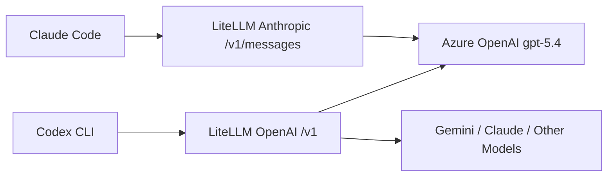

# 14. 用 LiteLLM 统一 Codex 与 Claude Code：Azure GPT-5.4 接入、协议踩坑与工具白名单落地

> Codex CLI 已经通过 LiteLLM 成功接入 Azure GPT-5.4。接下来我们希望进一步打通 Claude Code，并尽量保留 Claude Code 的工具能力，让两套 CLI 共用同一层模型代理、同一组模型别名和同一套启动习惯。这个过程的关键，并不是再额外维护一层“伪装 API”的长期 shim，而是让 Claude Code 直接复用 LiteLLM 的 Anthropic-compatible `/v1/messages`，同时对工具链进行白名单治理。

---

## 一、目标与最终结论

最终我们达成的是一条统一链路：

```text
Codex CLI      ─┐
                ├─ LiteLLM Proxy :4000 ──> Azure OpenAI GPT-5.4
Claude Code   ──┘
```

其中：

- **Codex CLI** 继续走 OpenAI 兼容入口
- **Claude Code** 改为直连 LiteLLM 的 Anthropic-compatible `/v1/messages`
- **模型别名统一为 `gpt54`**
- **Claude Code 不再加载全量 MCP，而是采用工具白名单 + MCP 白名单**

一句话总结：

> **Codex 与 Claude 共用一个 LiteLLM；GPT-5.4 作为统一“最强大脑”；Claude Code 的核心内置工具集可用，问题被收敛到少数不兼容 MCP。**

---

## 二、为什么最初思路会绕远

刚开始最自然的想法是：

```text
Claude Code
   ↓
自建 Anthropic-compatible Gateway
   ↓
LiteLLM
   ↓
Azure GPT-5.4
```

这条路短期内确实能通过 curl 跑通，因此一开始看起来是对的。

但真实接入 Claude Code CLI 后，问题暴露了：

1. Claude Code 并不会因为几个猜测性的环境变量就稳定切到你自建的 shim
2. 就算 shim 做得很像，长期仍然要自己维护 Anthropic headers、SSE 事件、错误格式、count_tokens、tool use 等兼容细节
3. LiteLLM 本身已经具备多协议代理能力，如果再叠一层长期 shim，会让链路复杂度持续上升

真正更稳的正解是：

```text
Claude Code
   ↓
LiteLLM /v1/messages
   ↓
Azure GPT-5.4
```

也就是说，不是“自己长期伪装 API”，而是**直接让 Claude Code 连接 LiteLLM 已有的 Anthropic-compatible 能力**。

---

## 三、统一代理层架构



### 分层职责

| 层级 | 职责 | 说明 |
|---|---|---|
| Codex CLI | OpenAI 风格客户端 | 通过 `base_url=http://127.0.0.1:4000/v1` 访问 LiteLLM |
| Claude Code | Anthropic 风格客户端 | 通过 `ANTHROPIC_BASE_URL=http://127.0.0.1:4000` 访问 LiteLLM |
| LiteLLM | 多协议统一代理层 | 同时暴露 OpenAI 兼容入口与 Anthropic-compatible `/v1/messages` |
| Azure OpenAI | 实际推理服务 | 最终执行 `gpt-5.4` |

这样做的价值是：

- 两类客户端共用同一层模型治理
- 切模型时只改 LiteLLM 配置，不改客户端
- Claude / Codex 的启动心智可以统一成“先起 LiteLLM，再起客户端”

---

## 四、LiteLLM 模型配置

核心配置保留在 `~/litellm_config.yaml`：

```yaml
general_settings:
  master_key: sk-proxy

litellm_settings:
  drop_params: true

model_list:
  - model_name: gpt54
    litellm_params:
      model: openai/gpt-5.4
      api_base: https://你的azure资源.openai.azure.com/openai/v1
      api_key: 你的Azure_Key

  - model_name: gemini
    litellm_params:
      model: gemini/gemini-3.1-pro-preview
      api_key: 你的Gemini_Key
```

说明：

- `gpt54` 是统一模型别名
- Codex 与 Claude 都指向它
- `drop_params: true` 用于过滤后端不支持字段，降低多客户端协议差异导致的 4xx

---

## 五、真实踩坑过程：从 shim 到直连 LiteLLM

### 阶段 1：自建 Claude Gateway 原型

我们在仓库里做了一个最小网关原型：

- `services/claude-gateway.mjs`
- `POST /v1/messages`
- `POST /v1/messages/count_tokens`
- SSE 文本流转发

这个原型能通过 curl 成功转到 LiteLLM，再落到 Azure GPT-5.4。

它验证了两件事：

1. Azure GPT-5.4 完全能承接 Claude 风格的消息语义
2. 转发链路本身不是问题

但到这里，它更像一个 **技术验证原型**，而不是最终推荐的长期产品形态。

### 阶段 2：发现 LiteLLM 已经能直接暴露 `/v1/messages`

随后我们直接对 LiteLLM 发起 Anthropic 风格请求：

```bash
curl http://127.0.0.1:4000/v1/messages \
  -H "Content-Type: application/json" \
  -H "x-api-key: sk-proxy" \
  -H "anthropic-version: 2023-06-01" \
  -d '{
    "model": "gpt54",
    "max_tokens": 128,
    "messages": [
      {"role": "user", "content": "reply with only: litellm-ok"}
    ]
  }'
```

结果直接返回：

```text
litellm-ok
```

这一步非常关键，它证明：

> **Claude Code 的主路径应该是 LiteLLM 自己的 `/v1/messages`，而不是再造一层长期 shim。**

---

## 六、Claude Code 真正的阻塞点：不是模型，而是工具 schema

当 Claude Code 真正打到 LiteLLM 后，新问题出现了：

```text
Invalid schema for function 'mcp__pencil__get_style_guide_tags'
object schema missing properties
invalid_function_parameters
```

这说明：

- Claude Code 到 LiteLLM 的网络链路已经通了
- LiteLLM 到 Azure GPT-5.4 的模型调用也通了
- 真正失败的是 **Claude Code 自动附带的工具定义 schema**

换句话说，阻塞点已经从“协议接入”转移成“工具描述兼容性”。

### 为什么会这样？

Claude Code 默认会注入：

- 内置工具（Bash / Edit / Read / Write / Grep / Glob ...）
- 本地 MCP server 暴露出来的工具

其中某些 MCP server 的 JSON Schema，对 Anthropic 原生没问题，但在 Azure/OpenAI 这条函数参数校验链路上会失败。

所以核心结论变成：

> **不是 Claude Code 工具整体不能迁移，而是某些 MCP server 的 schema 不能直接迁移。**

---

## 七、工具生态的真实可用边界

我们把工具能力拆开逐层验证，结果如下。

### 1. 无工具纯推理模式：可用

在禁用工具和禁用 MCP 的情况下，Claude Code 成功返回：

```text
claude-litellm-ok
```

这说明 GPT-5.4 作为 Claude Code 的“最强大脑”已经成立。

### 2. 内置核心工具：可用

经过白名单验证，以下 Claude Code 内置工具可以稳定使用：

- Bash
- Edit
- Read
- Write
- Glob
- Grep
- LS
- MultiEdit
- NotebookRead
- NotebookEdit
- WebFetch
- WebSearch

### 3. MCP 子集：部分可用

当前已验证可保留：

- `playwright`

当前必须隔离：

- `pencil`

于是最终工程形态变成：

```text
Claude Code + GPT-5.4
+ 内置工具白名单
+ 白名单 MCP（playwright）
- 问题 MCP（pencil）
```

这已经不是“只能聊天”的版本，而是一个能用于真实工程工作的版本。

---

## 八、最终可落地的运行方案

### 1. LiteLLM 启动脚本

统一脚本：

```bash
scripts/start-litellm.sh
```

最短命令：

```bash
llm
```

### 2. Claude Code 启动脚本

统一脚本：

```bash
scripts/cc-gpt54.sh
```

最短命令：

```bash
Claude_new
```

这个脚本会自动：

- 指向 `ANTHROPIC_BASE_URL=http://127.0.0.1:4000`
- 使用 `ANTHROPIC_MODEL=gpt54`
- 保留内置工具白名单
- 严格只加载 `.claude/mcp-gpt54.json`

### 3. Codex 启动方式

保持不变：

```bash
codex
codex -m gpt54
codex -m gemini
```

配套最短命令：

```bash
codex_new
```

---

## 九、Codex / Claude 的统一心智模型

最终使用方式被统一成非常接近的两步：

### 终端 1：启动代理

```bash
llm
```

### 终端 2：启动客户端

Codex：

```bash
codex_new
```

Claude Code：

```bash
Claude_new
```

这就是整个方案真正落地后的价值：

- 同一个 LiteLLM
- 同一个 `gpt54`
- 同一个 Azure GPT-5.4
- 客户端只是 `codex` 与 `claude` 的差异

---

## 十、为了换电脑后一键配置，我们抽了一个外部可复用代码库形态

为了避免这些脚本和配置永远散落在业务仓库内部，我们额外把核心能力抽象成一个可单独管理的工具包目录：

```text
packages/ai-cli-kit/
  bin/
  templates/
  docs/
```

它的目标很明确：

- 未来可以单独放到一个 GitHub 仓库
- 换电脑后只要拉这个仓库
- 填入自己的 Azure / Gemini / Anthropic Key
- 一键生成 `llm` / `codex_new` / `Claude_new`
- 一键生成 `~/litellm_config.yaml`、`~/.claude/settings.json`、白名单 MCP 配置

也就是说，下次你不需要再人工回忆这套链路，只需要：

1. 克隆工具仓库
2. 配置 key
3. 执行安装脚本

就能恢复完整环境。

---

## 十一、Phase 1 落地清单

- [x] **01** 验证 Codex 通过 LiteLLM 使用 Azure GPT-5.4
- [x] **02** 验证 LiteLLM `/v1/messages` Anthropic 兼容入口可用
- [x] **03** 验证 Claude Code 通过 LiteLLM 使用 Azure GPT-5.4
- [x] **04** 验证无工具模式可用
- [x] **05** 验证核心内置工具白名单可用
- [x] **06** 确认 `pencil` MCP 为主要 schema 阻塞项
- [x] **07** 产出 `.claude/mcp-gpt54.json` 白名单配置
- [x] **08** 产出 `llm / codex_new / Claude_new` 三个极简命令
- [x] **09** 抽离 `packages/ai-cli-kit` 作为外部仓库基础骨架

---

## 十二、当前边界与下一步

### 当前已实现

- GPT-5.4 已成功作为 Codex / Claude 的统一“最强大脑”
- Claude Code 的核心内置工具已保留
- Playwright MCP 已可继续使用
- 问题被收敛到少数不兼容 MCP，而不是整个平台不可用

### 当前未完全解决

- 还没有做到“全量 MCP 无损迁移”
- 还没有对每个 MCP server 自动做 schema sanitizer

### 下一步正确方向

不是继续堆复杂网关，而是：

1. 逐个审计 MCP server
2. 将不兼容 server 加入隔离名单
3. 对高价值 MCP 单独做 schema 兼容层
4. 将 `packages/ai-cli-kit` 独立成 GitHub 仓库，支持一键初始化

---

## 十三、实现总结

这次实践的真正价值，不是“又多写了几个脚本”，而是把一个看似混乱的多客户端、多协议、多模型问题，最终收束成了一套稳定的统一范式：

```text
一个 LiteLLM
一组模型别名
两类 CLI 客户端
一套统一启动方式
一套逐步扩展的工具白名单治理策略
```

对于 Codex，LiteLLM 是 OpenAI 兼容代理。

对于 Claude Code，LiteLLM 是 Anthropic-compatible 网关。

对于 Azure GPT-5.4，它则成为两边共享的真正思考核心。

而从工程管理角度看，最重要的成果是：

> **这套方案已经不再依赖“记忆”或“手工调试”，而是开始演化成一个可迁移、可复制、可在下一台电脑上一键恢复的工具化方案。**
